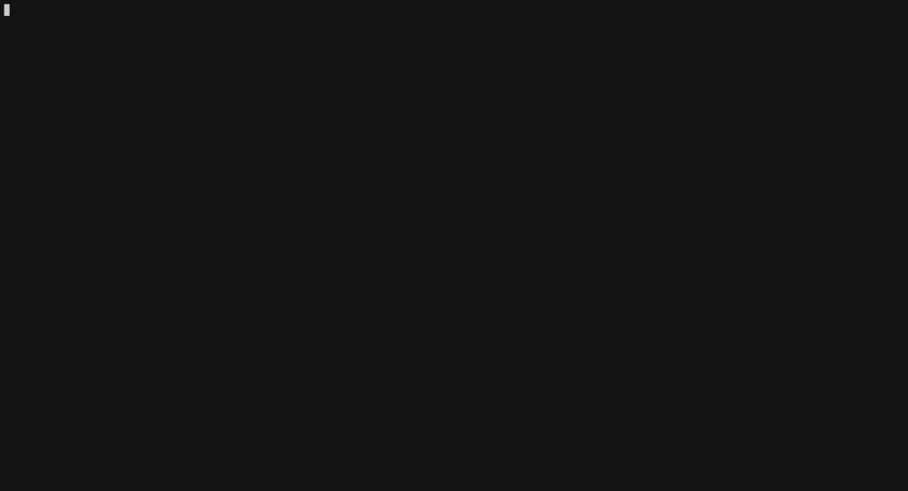

   

# TP : les scripts bash

- [TP : les scripts bash](#tp--les-scripts-bash)
  - [Objectifs](#objectifs)
  - [bash](#bash)
    - [Usage](#usage)
    - [shebang](#shebang)
    - [Des couleurs](#des-couleurs)
  - [Travail demandé](#travail-demandé)
    - [Exercice 1](#exercice-1)
    - [Exercice 2](#exercice-2)
    - [Exercice 3](#exercice-3)
  - [Tests unitaires](#tests-unitaires)
  - [Bac à sable et développement en ligne](#bac-à-sable-et-développement-en-ligne)
  - [Annexes : débogage de scripts _bash_](#annexes--débogage-de-scripts-bash)
    - [Tracer une variable](#tracer-une-variable)
    - [ShellCheck](#shellcheck)
    - [Bash Debug](#bash-debug)

---

## Objectifs

Les objectifs de ce TP sont d'être capable d'écrire des _shell_ scripts simples en _bash_ dans l'environnement GNU/Linux.

> Pour les enseignants, ceci est un "petit" devoir pour [Github Classroom](https://btssn-lasalle84.github.io/guides-developpement-logiciel/guide-classroom.html). Il montre l'utilisation des tests unitaires en bash, la notation automatique et l'insertion d'un badge pour l'affichage de la note.

## bash

[bash](https://fr.wikipedia.org/wiki/Bourne-Again_shell) (_Bourne-Again shell_) est un interpréteur en ligne de commande. C'est le _shell_ Unix du projet GNU.

> Un _shell_ Unix est un interpréteur de commandes destiné aux systèmes d'exploitation Unix et de type Unix qui permet d'accéder aux fonctionnalités internes du système d'exploitation. Il se présente sous la forme d'une interface en ligne de commande (CLI pour _command line interface_) accessible depuis la console ou un terminal. À l'origine, l'interpréteur de commandes par défaut était `sh`, qui donna naissance à de nombreuses variantes, dont `csh`, `ksh`, `zsh`, `ash`, `dash`, ... Aujourd'hui `bash`, s'inspirant de `sh`, `ksh`, et `csh`, est le _shell_ le plus répandu.

### Usage

Comme tous les interpréteurs en ligne de commande de type script, _bash_ exécute quatre opérations fondamentales :

1. Il fournit une liste de commandes permettant d'opérer sur l'ordinateur (lancement de programmes, copie de fichiers, etc.) ;
2. Il permet de regrouper ces commandes dans un fichier unique appelé **script** ;
3. Il vérifie la ligne de commande lors de son exécution ou lors d'une éventuelle procédure de vérification et renvoie un message d'erreur en cas d'erreur de syntaxe ;
4. En cas de validation, chaque ligne de commande est interprétée, c'est-à-dire traduite dans un langage compréhensible par le système d'exploitation, qui l'exécute alors.

Source : https://fr.wikipedia.org/wiki/Bourne-Again_shell

Les scripts sont de simples fichiers "texte" (codé en ASCII). Ils peuvent être directement exécutés par l'OS avec le droit `x` sous Unix ou interprétés par un _shell_, comme `/bin/bash` par exemple.

On a l'habitude de mettre l'extension `.sh` au fichier script :

```sh
$ file mkrep.sh
mkrep.sh: Bourne-Again shell script, ASCII text executable
```

Avec un script, il est possible :

- d'exécuter et/ou grouper des commandes
- d'utiliser des variables prédéfinies (`$?`, `$#`, ...), des variables d'environnement (`$HOME`, `$USER`, ...)
- de gérer ses propres variables
- de faire des traitements conditionnels (`if-then-else`, `case-select`) et/ou itératifs (`while`, `for`, `until`)
- d'écrire des fonctions (`function`)

### shebang

Le [shebang](https://fr.wikipedia.org/wiki/Shebang), représenté par `#!`, est un en-tête d'un fichier texte qui indique au système d'exploitation (de type Unix) que ce fichier n'est pas un fichier binaire mais un script (ensemble de commandes). Sur la même ligne est précisé l'interpréteur permettant d'exécuter ce script. Dans le TP, on utilisera : `#!/bin/bash`

Il est fortement conseillé que le script retourne son état d'exécution avec `exit`. La convention est que `0` indique que tout s'est bien passé et une valeur différente de 0 permettra d'indiquer un code d'erreur.

### Des couleurs

:eye: Les séquences d'échappement ANSI (apparus dans les années 1970) permettent de contrôler la couleur et le formatage du texte dans un terminal :

```sh
#!/bin/bash
# Séquence d'échappement ANSI : ESC[attribut;foreground;backgroundm
echo -ne "\x1B[1;31;49m"
# un texte en couleur
echo -n "Hello World !!!"
# revenir au mode normal :)
echo -e "\033[0m"
```

Lien : [Colors and formatting](https://misc.flogisoft.com/bash/tip_colors_and_formatting)

## Travail demandé

> Les scripts doivent avoir le droit d'exécution `x` : `chmod +x *.sh`

### Exercice 1

Créez un script `mkrep.sh` qui crée itérativement 100 répertoires nommés `toto1`, `toto2`, `toto3`, ... avec les droits `rwxr-x---` mais en utilisant le __mode octal__.


### Exercice 2

Écrire un script `note.sh` qui permet de faire l'addition de notes (entières) saisies au clavier, de cette façon :

```sh
$ ./note.sh
0
15
10
.
Somme = 25
```

_Bonus_ : Écrire un script `note-bonus.sh` qui ajoute le calcul et l'affichage de la moyenne. Pour cela, vous pouvez utiliser la calculatrice `bc` avec les options `-lq`.



### Exercice 3

Écrire un script `voyage.sh` qui reçoit en argument une _distance_ en km et qui fournit en résultat les messages suivants en fonction de la distance reçue : "petit voyage" (si la distance est inférieure ou égale à 2 km), "moyen voyage" (si la distance est inférieure ou égale à 40 km mais supérieure à 2 km) ou "grand voyage" (pour les distances supérieures à 40 km).


## Tests unitaires

Il existe une série de **tests unitaires** (utilisant [shUnit2](https://github.com/kward/shunit2)) pour chaque exercice de ce TP :

- exécuter tous les tests localement :

```sh
$ make tests
```

- exécuter un test localement, ici l'exercice n°1 :

```sh
$ make test-exo1
```

> Ils sont exécutés automatiquement à chaque `push` sur le dépôt [GitHub](https://github.com/btssn-lasalle84/). Les résultats des tests sont disponibles dans l'onglet `Actions` de l'interface web de [GitHub](https://github.com/btssn-lasalle84/) et la note apparaît sous la fome d'un badge sur la page d'acceuil.

## Bac à sable et développement en ligne

Il est souvent nécessaire de passer par un "bac à sable".

> En informatique, le bac à sable (sandbox) est une zone d'essai permettant d'exécuter des programmes en phase de test ou dans lesquels la confiance est incertaine. C'est notamment très utilisé en sécurité informatique pour sa notion d'isolation.

Il existe de nombreux sites web qui fournissent des EDI (Environnement de Développement Intégré) en ligne pour tester du code ou des services : un espace d'apprentissage séparé. Ils permettent aussi d'échanger des exemples.

Quelques sites :

- [OnlineGDB](https://www.onlinegdb.com/online_bash_shell) : https://www.onlinegdb.com/online_bash_shell
- Coding Ground For Developers : https://www.tutorialspoint.com/codingground.htm pour tout !
  - bash : https://www.tutorialspoint.com/execute_bash_online.php
- Codeanywhere (Cloud IDE) : https://codeanywhere.com/languages/bash

## Annexes : débogage de scripts _bash_

### Tracer une variable

On peut utiliser la commande `trap` pour tracer une variable lors de l'exécution d'un script. Si on utilise l'argument `DEBUG` (voir aussi `ERR`), la commande `trap` exécutera son action après chaque commande simple du script (une affectation de variable, une opération arithmétique, ... ou tout simplement une commande).

Exemple :

```sh
#!/bin/bash
# Affiche la valeur de $variable après chaque commande.
trap 'echo "<TRACE> \$variable = \"$variable\""' DEBUG

variable=29
let "variable *= 3"
((variable++))
echo "Fin"
exit 0
```

On obtient alors l'affichage suivant:

```sh
<TRACE> $variable = ""
<TRACE> $variable = "29"
<TRACE> $variable = "87"
<TRACE> $variable = "88"
Fin
<TRACE> $variable = "88"
```

Voir aussi : `set -o xtrace` et `set -o verbose`

### ShellCheck

L'extension [ShellCheck](https://marketplace.visualstudio.com/items?itemName=timonwong.shellcheck) permet de trouver trouver les erreurs de script courantes avant le débogage.

Pour Ubuntu :

```sh
sudo apt install shellcheck
```

Pour VS Code :

```sh
code --install-extension timonwong.shellcheck
```

Voir aussi : `set -o noexec`

### Bash Debug

Il existe aussi une extension pour Visual Studio Code nommée [Bash Debug](https://marketplace.visualstudio.com/items?itemName=rogalmic.bash-debug) qui fournit une interface graphique de débogage `bash` basée sur `bashdb`.

```sh
code --install-extension rogalmic.bash-debug
```

Utilisation :

- Sélectionnez Déboguer -> Ajouter une configuration pour ajouter une configuration de débogage personnalisée (menu déroulant, entrée de chemin, etc.)
- Sélectionnez Débogage -> Démarrer le débogage (F5) pour démarrer le débogage

Le fichier `/.vscode/launch.json` décrit une configuration de débogage

Quelques clés expliquées :

* on nomme les sessions de débogage avec la clé `name`
* on leur attribue un `type`, ici _bashdb_
* on leur associe un `program` à déboguer (ici le script `${file}` ouvert dans VSCode), les arguments seront définis un par un dans la clé `args` (ici aucun)
* on demande que l'exécution se place en pause au démarrage avec la valeur `true` pour la clé `stopAtEntry` (par défaut)


Exemple :

```json
{
    // Pour plus d'informations, visitez : https://go.microsoft.com/fwlink/?linkid=830387
    "version": "0.2.0",
    "configurations": [
        {
            "type": "bashdb",
            "request": "launch",
            "name": "Bash-Debug (simplest configuration)",
            "program": "${file}",
            "args": [ // input args
                "",
                ""
            ],
            //"showDebugOutput": true,
            //"trace": true
        }
    ]
}
```

Pour les scripts qui effectuent des saisies avec `read`, il faudra passer par un fichier rédirigé vers l'entrée standard `stdin` : `"args": ["<", "/path/to/your/stdin/file"]`

Sinon, évidemment `args` est utilisé pour passer des arguments au script à déboguer, exemple : `"args": ["numtel", "2"]`

---
Thierry Vaira : **[thierry(dot)vaira(at)gmail(dot)com](mailto:thierry.vaira@gmail.com)**
